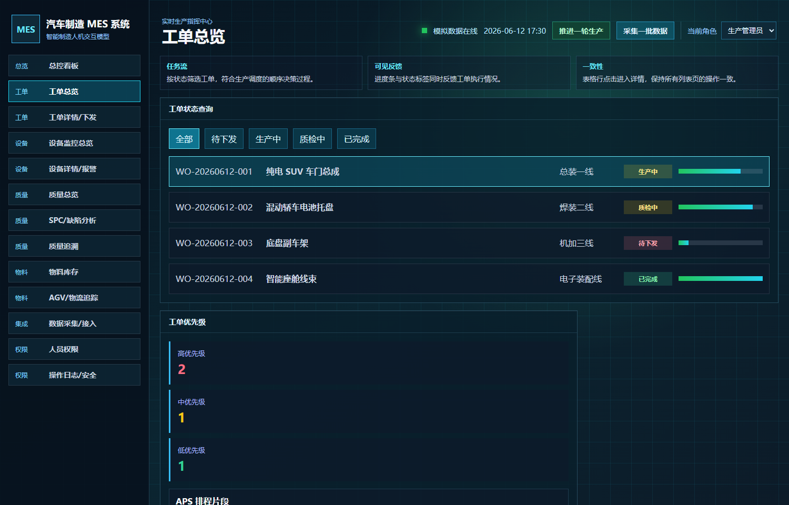
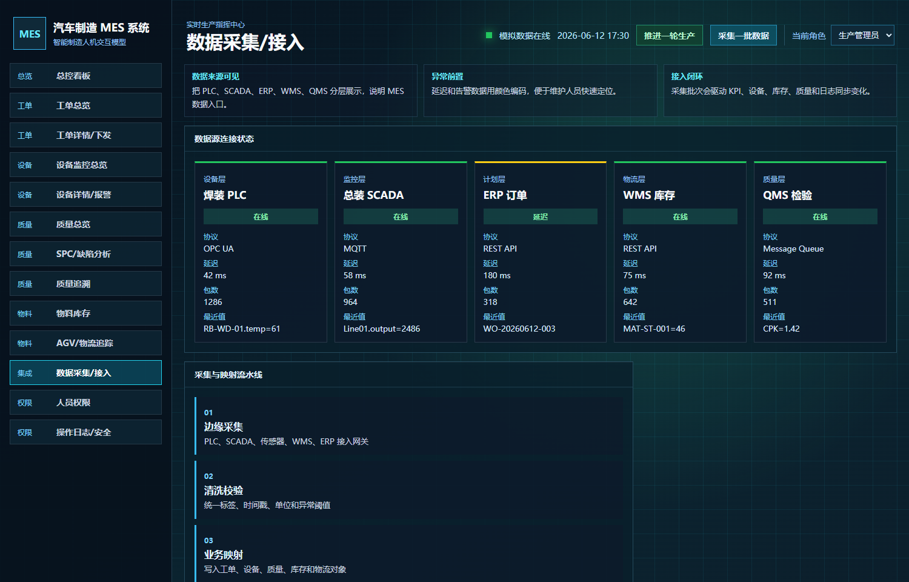

# Carmessys · 汽车制造 MES 交互原型

面向汽车制造现场，把工单执行、设备异常、质量信息和物料物流组织到同一套操作界面中。项目以“查看生产状态 → 定位业务对象 → 执行操作 → 查看反馈与日志”为主线，完成了 **13 个业务视图**，用于演示 MES 的信息组织和操作流程。

**项目成果是一套使用模拟数据、可在浏览器运行的前端交互原型。** 工单下发、报警确认、补货、AGV 任务分配和模拟采集会产生可见的状态反馈。

## 先看项目效果



工单页面把“待下发、生产中、质检中、已完成”放在同一条查看路径中。读者可以从订单列表进入详情，再观察下发后的状态变化。

| 已完成的内容 | 可以观察到的结果 | 对应实现 |
| --- | --- | --- |
| 工单查询与下发 | 待下发工单变为“生产中”，同时新增操作日志 | [工单操作](src/App.vue#L676) |
| 设备异常确认 | 设备变为“维护处理中”，界面给出记录编号并新增日志 | [报警处理](src/App.vue#L690) |
| 库存补货与 AGV 操作 | 补货按钮更新模拟库存；分配任务后，选中的 AGV 显示“运输中” | [库存与物流操作](src/App.vue#L714) |
| 一批数据的模拟采集 | 新增 4 条接入事件，更新产量、设备温度、钢板库存和日志 | [模拟采集](src/App.vue#L737) |
| 分层业务界面 | 13 个视图覆盖总控、工单、设备、质量、物料、接入和角色/日志展示 | [视图定义](src/mockData.ts#L105) |

## 一条可以复现的演示路线

1. 在“工单总览”选择待下发工单，进入详情并下发；返回列表查看状态，再到日志页查看新增记录。
2. 在“设备监控总览”选择有报警的设备，进入详情确认报警，查看“维护处理中”的反馈。
3. 在“物料库存”对低库存物料执行补货，再到“AGV/物流追踪”分配模拟运输任务。
4. 点击“采集一批数据”，查看新增的 4 条接入事件，再检查总控产量、设备温度、钢板库存与操作日志。



接入页面用 PLC、SCADA、ERP、WMS、QMS 五类模拟来源解释 MES 上下游关系，并展示数据来源、目标业务与处理结果。

[查看采集后的事件列表](_doc_assets/screenshots/07-integration-after-ingest.png) · [查看日志页面](_doc_assets/screenshots/08-logs.png)

## 关键设计

- **先看全局，再进入具体业务。** 总控看板集中展示生产状态；工单、设备、质量和物料页面提供进一步查看与操作入口。
- **操作与反馈放在同一条路径上。** 工单状态、设备状态、库存和 AGV 状态由前端维护，关键按钮同时生成反馈或日志，方便演示一次操作影响了什么。
- **集中定义业务数据。** 工单、设备、质量批次、物料和接入来源在 TypeScript 中定义，Vue 根据这些对象渲染页面。
- **区分可操作演示和信息展示。** 工单下发等动作具有状态变化；SPC、质量批次和角色权限用于展示相应业务的信息结构。

前端使用 Vue 3、TypeScript 和 Vite。项目还保留 Tauri 2 的桌面封装配置；桌面打包与 Windows 安装包不作为当前已验证的交付成果。

## 公开内容与运行

建议先看上方的项目效果与演示，再看关键设计，最后通过下表查看源码或运行项目。

| 位置 | 内容 |
| --- | --- |
| [src/App.vue](src/App.vue) | 页面、状态管理与交互操作 |
| [src/mockData.ts](src/mockData.ts) | 业务类型和初始模拟数据 |
| [src/style.css](src/style.css) | 界面样式 |
| [_doc_assets/screenshots](_doc_assets/screenshots) | 现有演示截图 |
| [src-tauri](src-tauri) | 桌面封装配置与 Rust 入口 |
| [start-carmessys.bat](start-carmessys.bat) | Windows 启动脚本 |

准备 Node.js 20 或 22 及以上版本，在项目目录运行：

```powershell
npm.cmd install
npm.cmd run dev
```

浏览器访问终端给出的地址，默认是 `http://127.0.0.1:1421`。也可双击 `start-carmessys.bat`，脚本会在缺少依赖时安装依赖。

Web 构建与预览：

```powershell
npm.cmd run build
npm.cmd run preview
```

Tauri 开发或打包还需要 Rust、Cargo、WebView2 以及带 Windows SDK 的 Visual Studio Build Tools，对应命令为 `npm.cmd run tauri dev` 和 `npm.cmd run tauri build`。

## 课程历史资料

| 资料 | 阅读用途 |
| --- | --- |
| [课程答辩旧稿](Carmessys汽车制造MES系统答辩演讲稿.txt) | 保留原课程汇报正文，开头附有与当前实现对应的简短勘误 |
| [课程讲义文字摘录](_doc_assets/ppt_text.txt) | 第三章人机交互设计原则、第四章视觉认知，共 120 页讲义的摘录，作为设计参考 |
| [PPT 制作脚本](_doc_assets/build_defense_ppt.mjs)、[课程文档制作脚本](_doc_assets/build_course_doc.py) | 历史材料的制作工具，不属于应用启动流程 |

了解课程背景时可继续阅读这些资料；当前项目成果与实现范围以本页及对应源码为准。PPT 制作脚本会覆盖同名演讲稿，不作为新版文档的生成入口。

## 当前边界

- 数据和状态保存在当前页面内存中，未连接数据库或真实工业设备。KPI、接口状态与截图中的预置日志均为演示内容。
- 角色选择改变展示和日志身份，尚无登录认证或权限拦截。补货直接修改模拟库存，AGV 分配固定示例任务。
- 质量批次、SPC 和趋势数据主要为预置展示；采集会新增 QMS 事件，但不会修改质量追溯页面的批次数据。
- 当前成果用于说明交互设计；尚无真实设备联调、桌面安装包验证或生产效率改善的测量结果。

仓库未附加开源许可证；公开源码的复用授权需由仓库所有者另行确认。
